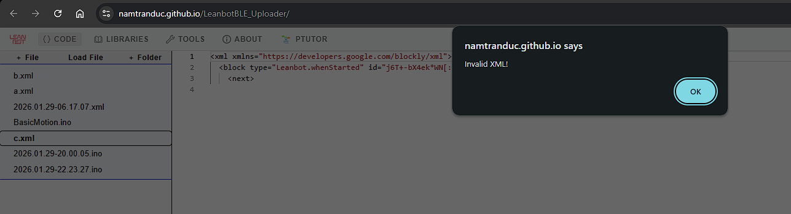
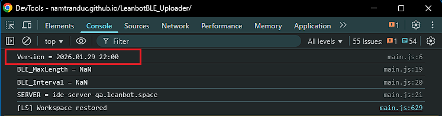
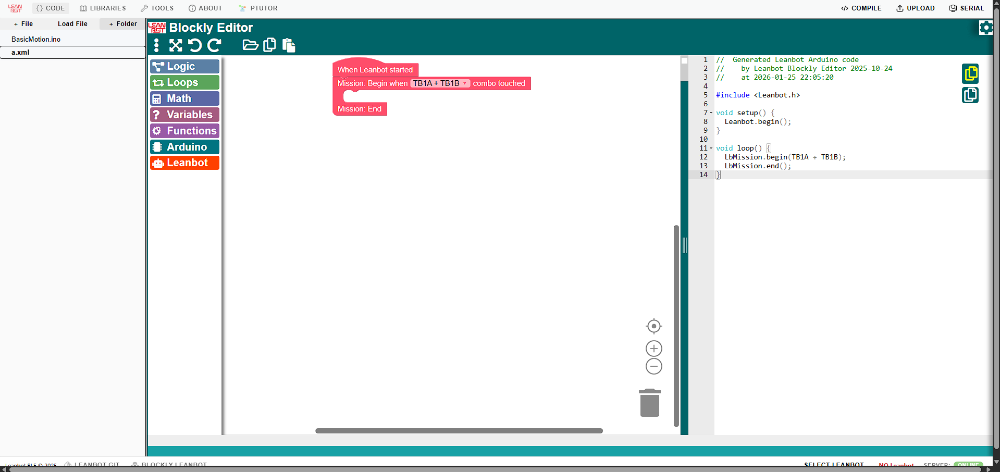

# LeanbotBLE_Uploader

# Demo

### Online

- https://namtranduc.github.io/LeanbotBLE_Uploader

### Local

- Create server, for example using python:
```
cd C:\Users\Dell\Downloads\LeanbotBLE_Uploader\
py -m http.server 8000
```
- Access: `http://localhost:8000/index.html`

# Change Log

---

## 2026-01-29

### 1. Switch to Monaco if Blockly file is invalid

- Code change: https://github.com/ptitopen-git/D11_TranDucNam/commit/8a9b66e




### 2. Correct source code when upload

- Code change: https://github.com/ptitopen-git/D11_TranDucNam/commit/00df833


### 3. Add null checking to fix upload error

- Code change: https://github.com/ptitopen-git/D11_TranDucNam/commit/612716f

- `event.thongtin` or `event.noidung` is sometimes null

```
main.js:1587 Uncaught (in promise) TypeError: Cannot read properties of null (reading 'replace')
  at shorten (main.js:1587:29)
  at logLbIDEEvent (main.js:1594:20)
  at leanbot.Compiler.onCompileError (main.js:245:3)
  at LeanbotCompiler.compile (LeanbotCompiler.js:58:40)
  at async LeanbotBLE.compileAndUpload (LeanbotBLE.js:163:27)
  at async HTMLButtonElement.<anonymous> (main.js:284:3)
```

### 4. Show version info in log

- Code change: https://github.com/ptitopen-git/D11_TranDucNam/commit/253f8a3




### 5. Allow using `*.bduino` file extension

- Code change: https://github.com/ptitopen-git/D11_TranDucNam/commit/0854d33

---

## 2026-01-28

### 1. Correct Blockly path

- Code change: https://github.com/ptitopen-git/D11_TranDucNam/commit/1abe9f5


### 2. Wrap Blockly iframe by container to show/hide correctly

- Code change: https://github.com/ptitopen-git/D11_TranDucNam/commit/d2d7bd5

```diff
  // LeanbotBLE_Uploader/index.html
+ <div id="blocklyEditor">
-   <iframe id="blocklyEditor"      src="LB-blockly/index.html"></iframe>
+   <iframe id="blocklyInlineFrame" src="LB-blockly/index.html"></iframe>
+ </div>


  // LeanbotBLE_Uploader/main.js
  function openFileInMonaco(content) {
    document.getElementById("codeEditor").style.display    = "block";  // show Monaco
+   document.getElementById("blocklyEditor").style.display = "none";   // hide Blockly
    ...
  }

  function openFileInBlockly(content) {
    document.getElementById("codeEditor").style.display    = "none";  // hide Monaco
+   document.getElementById("blocklyEditor").style.display = "block"; // show Blockly
    ...
  }
```

### 3. Allow loading xml file

- Code change: https://github.com/ptitopen-git/D11_TranDucNam/commit/1bd5f61


### 4. Hide Blockly content when overflow to prevent scrollbars

- Code change: https://github.com/ptitopen-git/D11_TranDucNam/commit/5f78252


### 5. Communicate with Blockly via global function in same origin

- Code change: https://github.com/ptitopen-git/D11_TranDucNam/commit/2b3bc05
  - Add wrapper `LeanbotBLE_Uploader/BlocklyEditor.js` to call Blockly global window functions
  - Because parent and iframe are in the same origin, don't need to use `postMessage`
  - Note: `Blockly global window functions` must be declared after Blockly workspace created by `Blockly.inject()`

- __`LeanbotBLE_Uploader/LB-blockly/js/init.js`__
```diff
  Code.init = function () {
    ...
    Code.workspace = Blockly.inject(...);
    ...

    // declare global API after Blockly.inject()
+   window.Blockly_getGeneratedCode = function() => {
      return Blockly.Arduino.workspaceToCode(Code.workspace);
    };

+   window.Blockly_getBlockContent = function() {
      var xmlData = Blockly.Xml.workspaceToDom(Code.workspace);
      return Blockly.Xml.domToPrettyText(xmlData);
    };

+   window.Blockly_setBlockContent = function(contentString) {
      let xml;
      try {
        xml = Blockly.Xml.textToDom(contentString);
      } catch (e) {
        alert("Invalid XML!\n" + e.message);
        return;
      };
      Code.workspace.clear();
      Blockly.Xml.domToWorkspace(xml, Code.workspace);
    }

+   notifyBlockChange = function() {
        if (window.parent.onChangeBlockly) {
            clearTimeout(Blockly_changeTimer);
            Blockly_changeTimer = setTimeout(() => {
                window.parent.onChangeBlockly();
            }, 150);
        }
    }
+   Code.workspace.addChangeListener(notifyBlockChange);
  }
```

- __`LeanbotBLE_Uploader/BlocklyEditor.js`__
```diff
  export class BlocklyEditor {
+   getContent() {
      const iframe = document.getElementById("blocklyInlineFrame");
      return iframe.contentWindow.Blockly_getBlockContent();
    }

+   setContent(contentString) {
      const iframe = document.getElementById("blocklyInlineFrame");
      iframe.contentWindow.Blockly_setBlockContent(contentString);
    }

+   getCppCode() {
      const iframe = document.getElementById("blocklyInlineFrame");
      return iframe.contentWindow.Blockly_getGeneratedCode();
    };
  }
```

---

## 2026-01-25

### 1. Create initial code `LeanbotBLE_Uploader`
- Copy folder `LeanbotBLE_Uploader` from: https://git.pythaverse.space/theanhpham/baocao/tree/master/Document/InoEditorGuide

### 2. Create initial code `LB-blockly`
- Create sub-folder `LB-blockly`, copy from: https://github.com/giangduong/LB-blockly/tree/main
- Folder structure:
```diff
  LeanbotBLE_Uploader/
  │
+ ├─ LB-blockly/
+ │  ├─ css/
+ │  ├─ js/
+ │  ├─ index.html
+ │  ...
  │
  ├─ main.js
  ├─ index.html
  ├─ README.md
```

### 3. Integrate `LB-blockly` into `LeanbotBLE_Uploader`

- Code change: https://github.com/ptitopen-git/D11_TranDucNam/commit/6b40492

#### 3.1. Embed interface

- Use inline frame to embed entire `LB-blockly` interface into container `#blocklyEditor`
- `#blocklyEditor` has the same position with `#codeEditor` for InoEditor

```diff
  // LeanbotBLE_Uploader/styles.css
+ #blocklyEditor {
+   width: 100%;
+   height: 100%;
+ }

  // LeanbotBLE_Uploader/index.html
  <div id="editorSection">

    <!-- Show Monaco on top -->
    <div id="codeEditor"></div>

+   <!-- Embed Blockly on bottom -->
+   <iframe id="blocklyEditor" src="LB-blockly/index.html"></iframe>

  </div>

```

#### 3.2. Switch displaying BlocklyEditor or InoEditor based on file extension

- Toggle `display` attribute to show/hide the interface

```diff
  // LeanbotBLE_Uploader/main.js
+ function openFileInMonaco(content) {
+   document.getElementById("codeEditor").style.display = "block";  // show Monaco to hide Blockly

+   inoEditor.setContent(content);
+   inoEditor.setReadOnly(false); // exit read-only mode when open file
+ }

+ function openFileInBlockly(content) {
+   document.getElementById("codeEditor").style.display = "none";  // hide Monaco to show Blockly
+
+   // TODO: forward content to Blockly
+ }

  function openFileInEditor(fileId) {
    if (isFolder(fileId)) return; // avoid if a folder is passed

    if (!inoEditor.__isMonacoReady|| !inoEditor) {
      window.__pendingOpenFileId = fileId;
      return;
    }

    const content = fileContents[fileId] ?? "";
    window.currentFileId = fileId;

+   // check by file extension
+   const it = items[fileId];
+   const name = String(it.data || "").trim().toLowerCase();
+   const isBlocklyFile = name.endsWith(".xml");

+   if ( isBlocklyFile ) {
+     openFileInBlockly(content)
+   } else {
+     openFileInMonaco(content)
+   }

    saveWorkspaceFilesToLocalStorage();
  }
```

- Click on xml file to display Blockly:




### 4. TODO
- Communicate between Blockly in iframe with parent page to get/set Blockly content
  - Might need to use `postMessage` because iframe and parent are isolated

---
